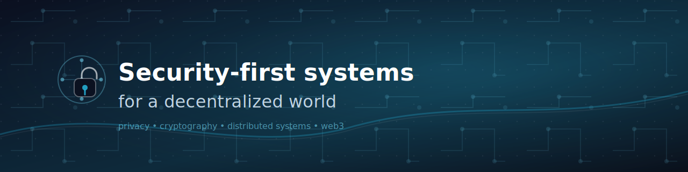

<p align="center">
  
</p>

# Ian Dorion 👋

**Software Engineer · Security · Distributed Systems · Web3 Infrastructure**

<div align="center">

```text
┌──────────────────────────────────────────────────────────────────────────────┐
│  ian.dorion@system:~$ cat profile.yaml                                        │
└──────────────────────────────────────────────────────────────────────────────┘
```

</div>

<div align="center">

<pre style="background:#0b1020; color:#39ff14; padding:16px; border-radius:14px; line-height:1.35; text-align:left; max-width:900px; overflow:auto;">
name: "Ian Dorion"
tagline: "Security-first systems for a decentralized world"
role:
  - Software Engineer
  - Security
  - Distributed Systems
  - Web3 Infrastructure

mission: >
  Design and ship privacy-first, security-critical systems at the intersection of
  distributed systems, cryptography, and blockchain infrastructure.

impact_focus:
  - reduce_systemic_risk_in_production
  - prevent_missed_onchain_events
  - eliminate_brittle_architectures
  - replace_complexity_with_principled_design

focus_areas:
  - application_and_protocol_security
  - cryptography_and_key_management
  - distributed_systems_and_event_driven_architecture
  - smart_contracts_defi_and_cross_chain_infra
  - privacy_first_wallet_connectivity_and_auth

flagship_work:
  - name: "QuantumAuth"
    description: "Privacy-first Web3 authentication & wallet connectivity"
    guarantees:
      - transparency_over_convenience
      - no_third_party_relays
      - security_by_design

  - name: "Blockchain Indexing & Reliability"
    description: "Production-grade indexers ensuring complete event coverage"
    invariants:
      - no_event_gaps
      - deterministic_replay
      - verifiable_state

  - name: "DeFi Infrastructure"
    description: "Token-less yield farming & broker-managed DeFi workflows"
    priorities:
      - minimize_user_friction
      - preserve_protocol_integrity
      - operational_safety

open_source_and_community:
  - project: "Compound Finance"
    contribution: "Reported oracle manipulation vulnerability"
    outcome: "Protected protocol integrity"

  - project: "Ethereum Magicians"
    contribution: "Wallet security, privacy models, post-quantum signature discussions"
    outcome: "Raised security and deployability standards"

  - project: "GitHub Desktop"
    contribution: "Enabled IntelliJ IDEA integration"
    outcome: "Improved developer experience"

  - project: "OpenZeppelin Community"
    contribution: "Smart contract security & best-practice design discussions"
    outcome: "Strengthened patterns and guidance"

engineering_philosophy:
  - "security_is_a_system_property_not_a_feature"
  - "fail_closed_by_default"
  - "simplicity_beats_cleverness_in_production"
  - "transparency_builds_trust_obscurity_builds_risk"
  - "architecture_decisions_outlive_code"

connect:
  website: "https://quantumauth.io"
  linkedin: "https://www.linkedin.com/in/ian-dorion/"
  email: "hello@quantumauth.io"
</pre>

</div>

<p align="center">
  
</p>